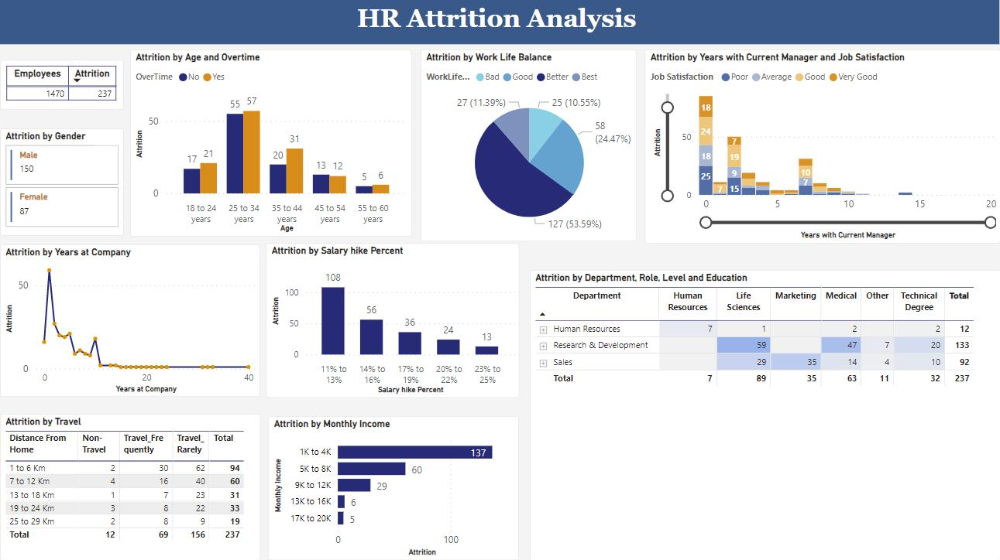

        
# HR Analytics Dashboard

## Project Overview

This Power BI dashboard analyzes employee attrition,
salary trends and workforce distribution.

## Tools Used

- Power BI
- Excel
- DAX

## KPIs

- Total Employees
- Attrition Count
- Attrition Rate
- Average Salary

## Key Insights

- Sales department showed highest attrition.
- Employees with lower salary had higher attrition.
- Age group 26-35 showed maximum turnover.

## Dashboard Screenshot

# Author

Mohit Kasana
